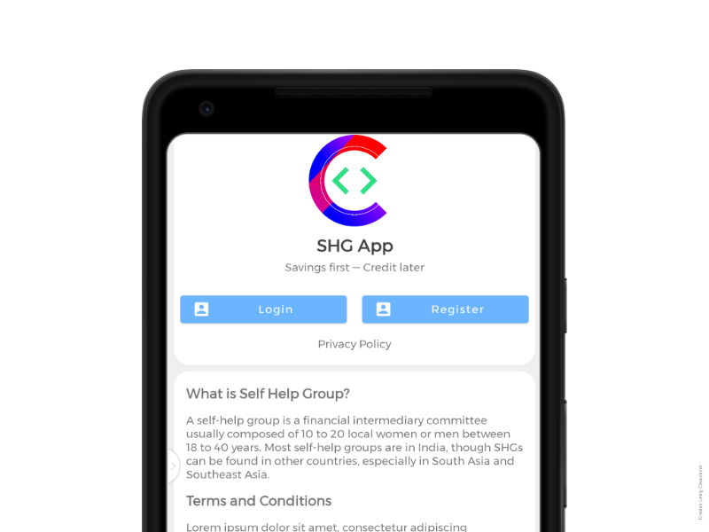
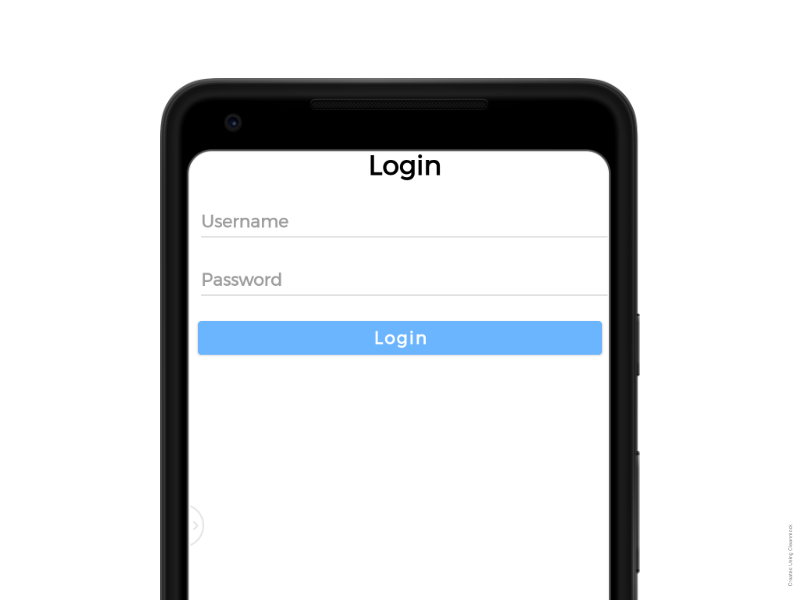
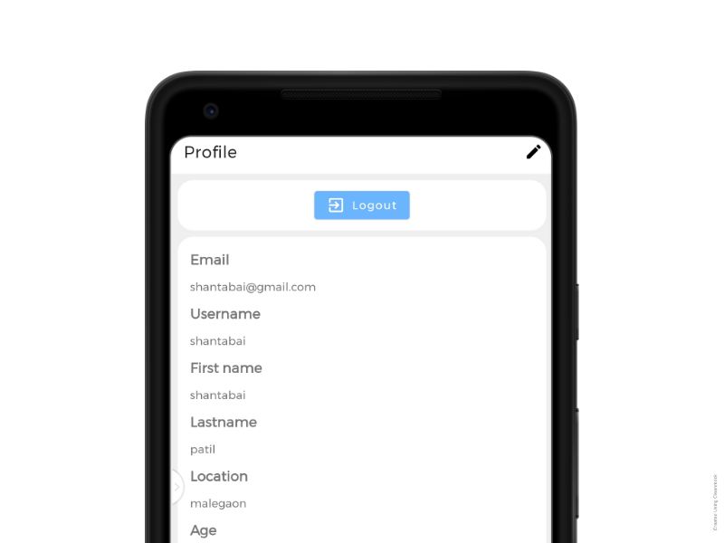
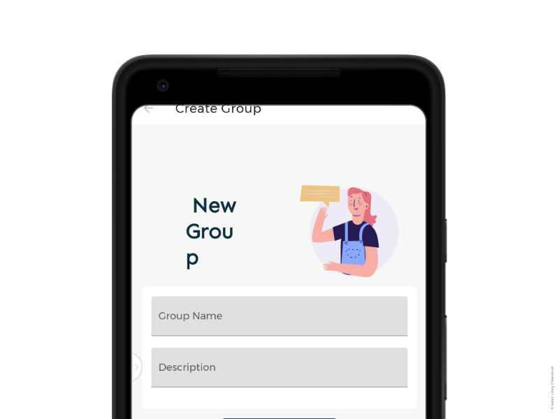
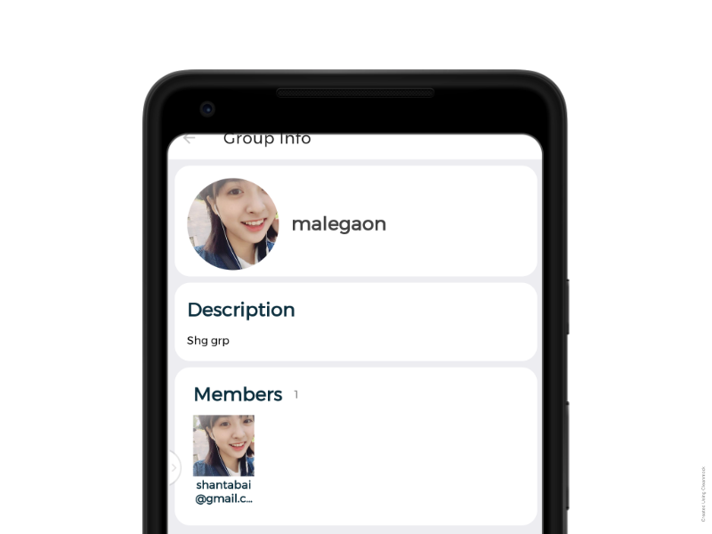
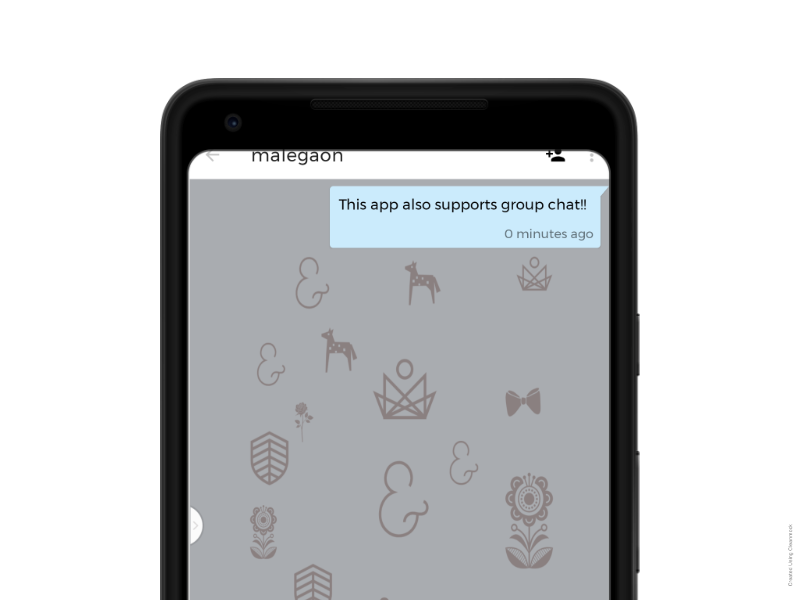

<h1 align="center">Yue SHG App</h1> 

:eyeglasses: Yue App for Self Help Groups

 

  
  
  

 

</img>

 

**Yue SHG App** aims to be the starting point for people to get involved in SHG in their nearby areas.

An offline-first MIS client Android app that lets you view data entries, add records and perform
transactions even if you are offline.

## Contents

- [Demo](#demo)
- [Codebase Focus](#codebase-focus)
- [Use Case](#use-case)
- [Technologies used](#technologies-used)

## Codebase Focus

Codebase focuses 👓 on following key things:
- Single Source of Truth Principal = Local Database
- Offline first with Room Persistence
- Flexible and Compatible with pre-existing centrally designed MIS server and database
- Clients should not wait on callbacks, we use WorkManager for Job Scheduling
- Reactive UIs using LiveData

## Use Case

As per requirement, App user (SHG) can view data entries offline stored in local cache, add records offline.
Records are synced with server in the order they are created to avoid data gaps.

## Demo 

### SHG Core

	 
    </img>
    </img>
    </img>

### SHG Chat

	 
    </img>
    </img>
    </img>

## Technologies used:

* [Retrofit](https://square.github.io/retrofit/) a REST Client for Android which makes it relatively easy to retrieve and upload JSON (or other structured data) via a REST based webservice.
* [ViewModel](https://developer.android.com/topic/libraries/architecture/viewmodel) to store and manage UI-related data in a lifecycle conscious way.
* [LiveData](https://developer.android.com/topic/libraries/architecture/livedata) to handle data in a lifecycle-aware fashion.
* [Navigation Component](https://developer.android.com/guide/navigation) to handle all navigations and also passing of data between destinations.
* [Work Manager](https://developer.android.com/topic/libraries/architecture/workmanager) to manage Android background jobs.
* [Material Design](https://material.io/develop/android/docs/getting-started/) an adaptable system of guidelines, components, and tools that support the best practices of user interface design.
* [Coroutines](https://kotlinlang.org/docs/reference/coroutines-overview.html) used to manage the local storage i.e. `writing to and reading from the database`. Coroutines help in managing background threads and reduces the need for callbacks.
* [Room](https://developer.android.com/topic/libraries/architecture/room) persistence library which provides an abstraction layer over SQLite to allow for more robust database access while harnessing the full power of SQLite.
* [Dagger](https://dagger.dev) Dependency Injection.

## Installation

Clone the repository. Open in Android Studio. Sync Gradle and Run.

## :computer: Thank You